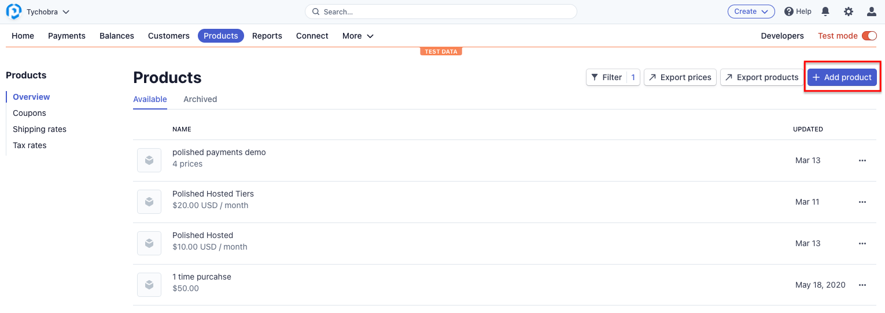
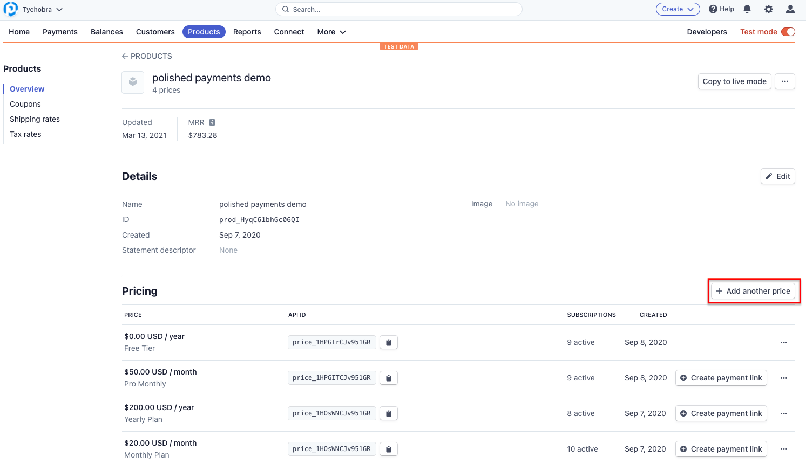

# Polished Payments

[](https://www.tidyverse.org/lifecycle/#maturing)

R package to easily add a [Stripe](https://stripe.com/) subscription with multiple price tiers to a Shiny app using the [polished R package](https://github.com/Tychobra/polished).

### Installation

This package requires the most recent dev version of the {polished} package.  Install it from GitHub using the following command:

```
# Install `polished` if you don't already have it
remotes::install_github("tychobra/polished")

remotes::install_github("tychobra/polishedpayments")
```

### Getting Started

1. Create a [Stripe](https://stripe.com/) account  

2. Create a new Stripe **Product**.  
  


3. Create 1 to 4 Stripe **Prices**  
  


4. Configure your Shiny app with your Stripe information using `polished_payments_config()` in `global.R`.  
  
      ```
      polishedpayments::polished_payments_config(
        stripe_secret_key = <your Stripe secret key>,
        stripe_public_key = <your Stripe public key>,
        subscription_prices = <your Stripe subscription price(s)>,
        trial_period_days = <Stripe subscription trial period days>,
        free_roles = <polished role(s) to allow free user access to subscriptions>
      )
      ```

5. Wrap your Shiny server in `payments_server()`. e.g.

      ```
      my_server <- polishedpayments::payments_server(
        server = function(input, output, session) (
        
        # your custom Shiny app's server logic
        
        )
      )
      
      polished::secure_server(my_server)
      
      ```
      
      **OR**
      
      ```
      my_server <- function(input, output, session) (
        
        # your custom Shiny app's server logic
        
      )
      
      payments_server(my_server) %>%
        polished::secure_server()
      ```
  
6. Add Polished Authentication with `polished::secure_ui()` and `polished::secure_server()`.   
    
    ```
    # Server
    polished::secure_server(my_server)
    
    # UI
    polished::secure_ui(ui)
    ```
  
Each user's subscription status will be checked before the Shiny app's server logic starts.  If the user does not have a subscription, `polishedpayments` will set them up with the default subscription.  If the user has a subscription that is either in it's free trial period, or the user has set up a payment method for a subscription, then `polishedpayments` will allow the user to continue to the Shiny app after signing in.  If the user has a subscription in which the free trial has expired, and they still have not enabled a payment method, `polishedpayments` will redirect the user to the **Payments** page to enable billing for their subscription.  In this case (expired trial period), the user will not be able to access the main Shiny app until they've enabled billing.
  
7. (Optional) Add a button or link to redirect user to the **Account** page with `go_to_payments()`  

- Example app available: <a href="https://github.com/Tychobra/polishedpayments/tree/master/inst/examples/polished_payments_min">https://github.com/Tychobra/polishedpayments/tree/master/inst/examples/polished_payments_min</a>

